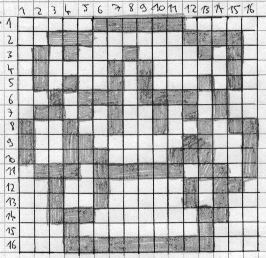
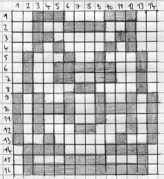
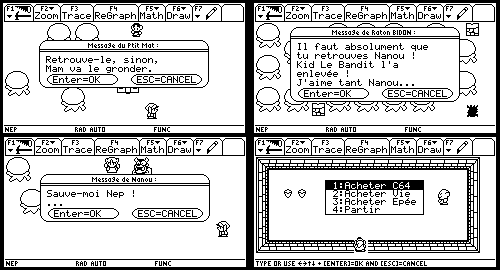

# nepquest
Nepemy's Quest, a Zelda clone for Texas Instruments TI-92 calculators.
# Presentation
Back in 1999/2000 I decided to take on a quite ambitious task: program a Zelda-like game on my Texas Instruments TI-92 calculator simply using the built-in language.
There were two challenges:
- Overcome the memory limitations of the machine (I had 64K to work with),
- Get nice-looking graphics to be displayed smoothly on a slow black & white LCD screen.
The sprites were manually ripped from a video games magazine using oldschool pen & grid paper, then converted into X,Y dots entered one by one into a matrix stored in the TI-92 memory. A long process made even harder by the lack of reliability of the TI-Graph Link data transfer cable of that era. I had to loop a small portion of the cable through a ferrite ring in order to fix it and make it 100% reliable.
## What this game is about
*Nepemy's Quest* is a Zelda-like game inspired by the original Game Boy Link's Awakening opus.
## Language
The game is in French.
## Graphics sample

# How to run the game
On an emulator or on real hardware, start *NEPQUEST.92P*.